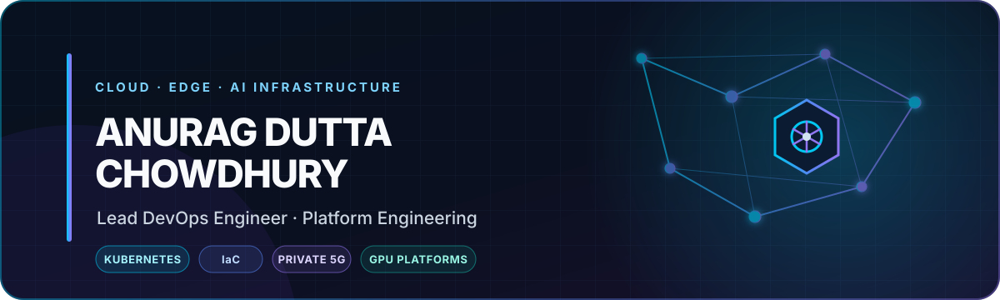
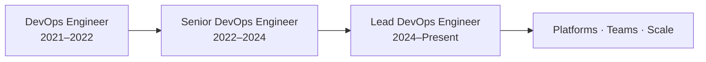

<p align="center">
  
</p>

<p align="center">
  <a href="https://www.linkedin.com/in/anuragdc"></a>
  <a href="mailto:anuragdchowdhury.mail@gmail.com"></a>
  
</p>

<h3 align="center">I turn complex infrastructure into reliable platforms that teams can ship on.</h3>

<p align="center">
  Lead DevOps & Platform Engineer working across cloud, edge, networking, Private 5G and AI/GPU infrastructure.<br/>
  I build the automation, guardrails and observability that make distributed systems easier to operate—and help engineers grow while doing it.
</p>

---

## Impact at a glance

<div align="center">

| **5+ years** | **~13 engineers** | **~40% less manual effort** | **~30% faster deployments** |
|:---:|:---:|:---:|:---:|
| Cloud-native delivery | Led & mentored | Through reusable automation | Through CI/CD improvements |

</div>

## What I build

<table>
  <tr>
    <td width="50%" valign="top">
      <h3>☸️ Platform foundations</h3>
      Kubernetes platforms, deployment standards and reusable infrastructure patterns designed for consistency across cloud, edge and enterprise environments.
    </td>
    <td width="50%" valign="top">
      <h3>⚡ Delivery systems</h3>
      CI/CD architecture and Python/Bash automation that shorten feedback loops, reduce operational toil and make releases repeatable.
    </td>
  </tr>
  <tr>
    <td width="50%" valign="top">
      <h3>📡 Distributed infrastructure</h3>
      Production systems at the intersection of cloud-native infrastructure, enterprise networking, SDN, edge computing and Private 5G.
    </td>
    <td width="50%" valign="top">
      <h3>🧠 AI/GPU platforms</h3>
      Containerized AI services, GPU resource orchestration and NVIDIA MIG-based infrastructure built with reliability and operability in mind.
    </td>
  </tr>
</table>

## Technology radar

<p align="center">
  
</p>

<p align="center">
  
  
  
  
  
</p>

```text
Cloud & Containers       Kubernetes · Docker · AWS · Azure · Edge Computing
IaC & Automation         Terraform · Ansible · CI/CD · Python · Bash
Reliability              Prometheus · Grafana · ELK · Linux · Troubleshooting
Networks & Telecom       Private 5G · SDN · Enterprise Networking
AI Infrastructure       FastAPI · Containerized AI · GPU Orchestration · NVIDIA MIG
Leadership               Team Leadership · Mentorship · Design Reviews · Delivery
```

## How I lead

- Set technical direction while staying close to architecture, automation and production troubleshooting.
- Create reusable standards and guardrails that help teams move faster without trading away reliability.
- Mentor engineers through design reviews, real ownership and thoughtful technology choices.
- Connect application, infrastructure and networking perspectives to solve cross-layer problems.

## Career snapshot



> 🏆 **Recognition:** Best Innovation in 5G

---

<p align="center">
  <b>Building dependable platforms for ambitious systems and the people behind them.</b><br/>
  <sub>Open to conversations about platform engineering, Kubernetes, edge infrastructure, Private 5G and AI/GPU operations.</sub>
</p>

